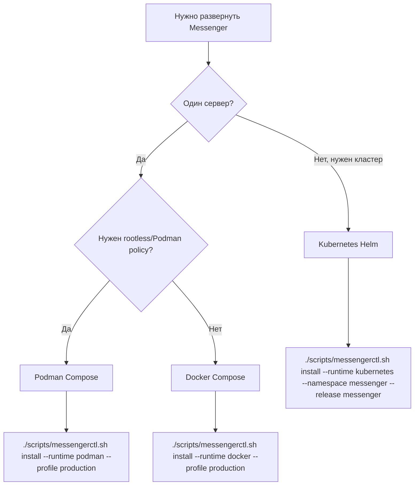
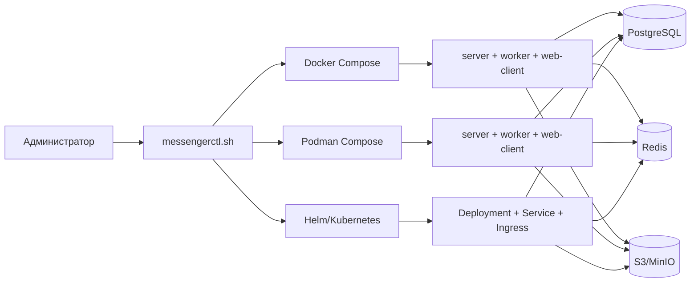
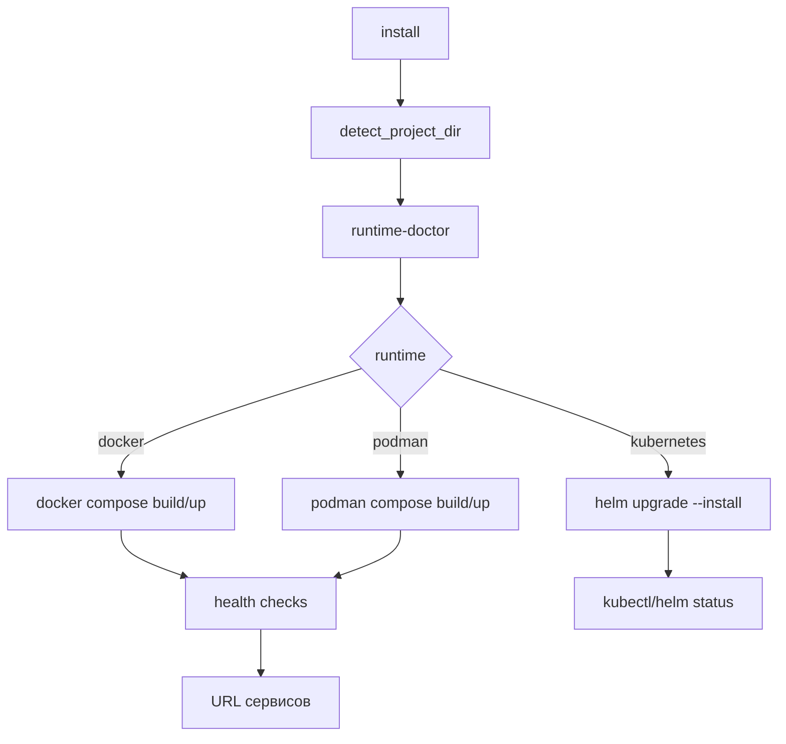
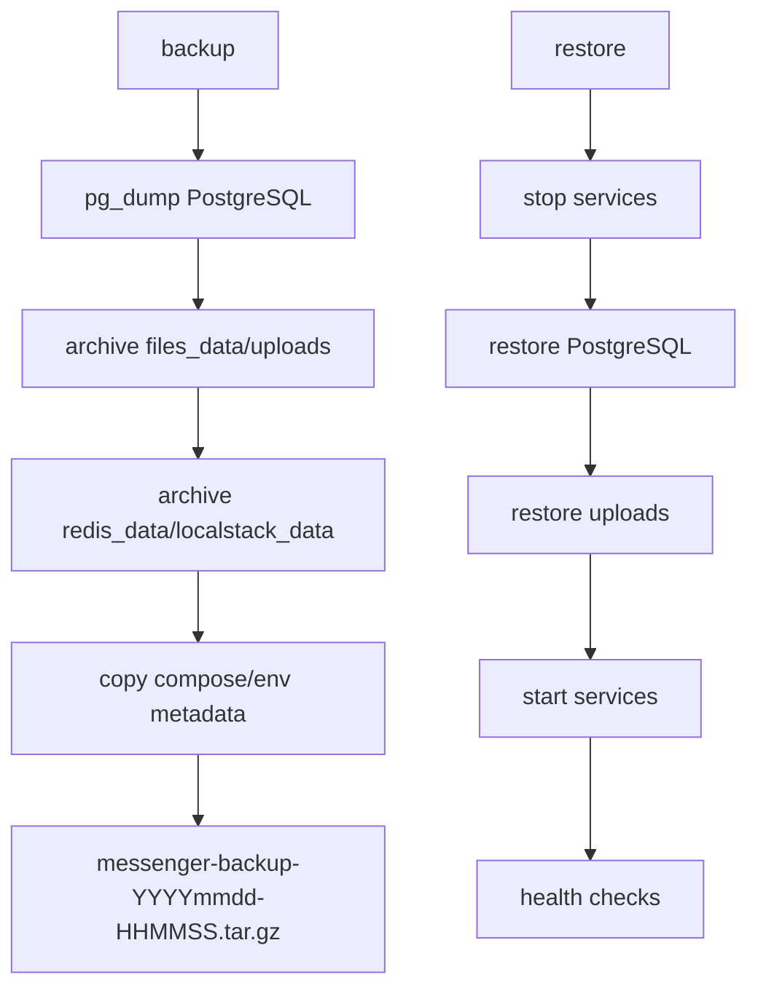
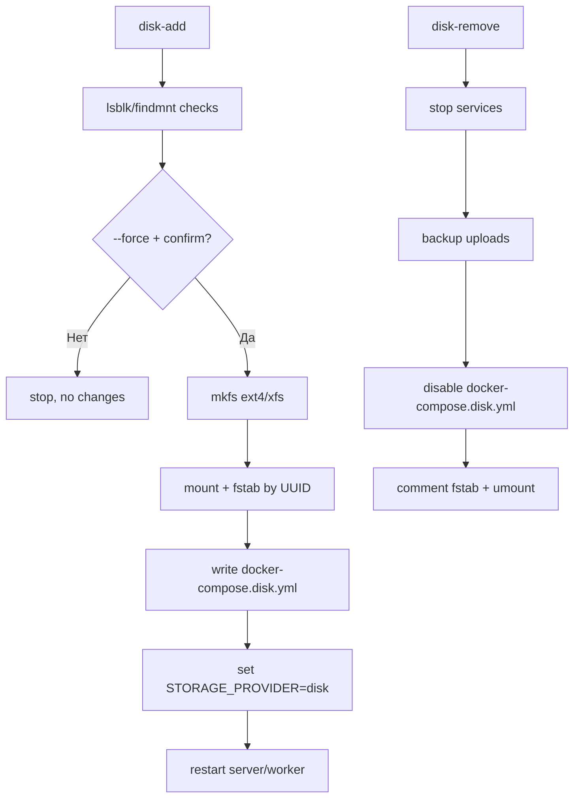
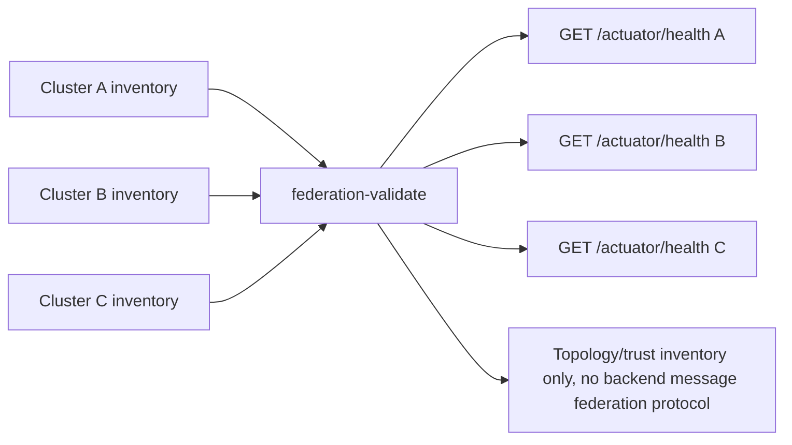

# Матрица развертывания

Документ сравнивает поддерживаемые пути запуска Messenger: Docker Compose, Podman Compose и Kubernetes Helm. Все команды предполагают запуск из корня репозитория.

## Как выбрать runtime



## Сравнение

| Критерий | Docker Compose | Podman Compose | Kubernetes Helm |
| --- | --- | --- | --- |
| Основной сценарий | single-host dev/prod-like | single-host prod/rootless-friendly | multi-node/cluster |
| Production template | `docker-compose.production.yml.example` | `podman-compose.production.yml.example` | `helm/values-production.example.yaml` |
| Запуск через скрипт | `--runtime docker` | `--runtime podman` | `--runtime kubernetes` |
| Reverse proxy | host Nginx/Caddy | host Nginx/Caddy | Ingress |
| Storage | Docker volumes, bind mount, S3 | Podman volumes, bind mount, S3 | PVC/external DB/Redis/S3 |
| Disk operations | `disk-*` commands | `disk-*` commands | через StorageClass/PV, не через host disk commands |
| Federation inventory | `deploy/federation/*.yml` | `deploy/federation/*.yml` | Helm values + inventory |
| Rollback | backup + previous compose/images | backup + previous compose/images | `helm rollback` + backup restore |

## Общий граф deployment



## Flow установки



## Flow backup/restore



## Flow disk add/remove



## Federation topology



## Команды

```bash
./scripts/messengerctl.sh install --runtime docker --profile production
./scripts/messengerctl.sh install --runtime podman --profile production
./scripts/messengerctl.sh install --runtime kubernetes --namespace messenger --release messenger --values helm/values-production.example.yaml
./scripts/messengerctl.sh federation-validate
```
