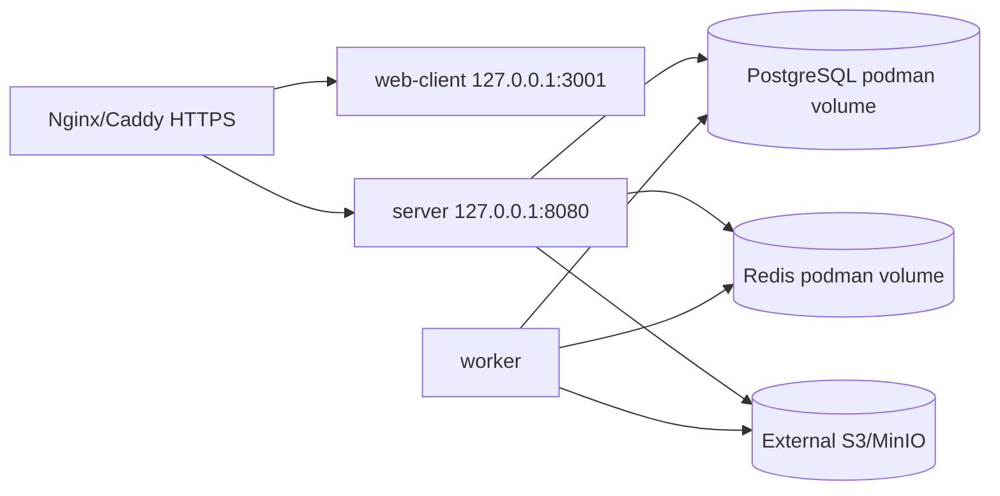

# Развертывание через Podman Compose

Podman Compose предназначен для production-like single-host установки, где Docker недоступен или предпочтителен rootless/container-policy подход.

## Требования

- Linux x86_64.
- `podman`.
- `podman compose` или `podman-compose`.
- `git`, `openssl`, `curl` или `wget`, `tar`, `gzip`.
- Для disk storage: `lsblk`, `findmnt`, `mount`, `umount`, `blkid`, `mkfs.ext4` или `mkfs.xfs`.

Проверка:

```bash
podman version
podman compose version || podman-compose --version
./scripts/messengerctl.sh runtime-doctor --runtime podman --profile production
```

## Topology



## Подготовка

```bash
cp .env.production.example .env
cp podman-compose.production.yml.example podman-compose.production.yml
openssl rand -base64 64
```

Замените в `.env` все placeholders: `JWT_SECRET`, `POSTGRES_PASSWORD`, S3/MinIO credentials, `CORS_ALLOWED_ORIGINS`, `WS_ALLOWED_ORIGINS`.

## Запуск

Через скрипт:

```bash
./scripts/messengerctl.sh install --runtime podman --profile production
```

Ручной запуск:

```bash
podman compose -f podman-compose.production.yml up -d --build
```

Если используется standalone `podman-compose`:

```bash
podman-compose -f podman-compose.production.yml up -d --build
```

## Rootless и SELinux

- Rootless Podman может не иметь права bind на privileged ports `80/443`; используйте host reverse proxy или rootful service.
- Для bind mounts на SELinux hosts используйте `:Z` или `:z`. В template named volume `files_data` уже использует `:Z` для app containers.
- Для dedicated uploads disk используйте `disk-add`, затем проверьте SELinux labels при bind mount.

## Управление

```bash
./scripts/messengerctl.sh status --runtime podman --profile production
./scripts/messengerctl.sh logs --runtime podman --profile production --service server --tail 200
./scripts/messengerctl.sh update --runtime podman --profile production
./scripts/messengerctl.sh stop --runtime podman --profile production
./scripts/messengerctl.sh start --runtime podman --profile production
```

## Backup и restore

```bash
./scripts/messengerctl.sh backup --runtime podman --profile production
./scripts/messengerctl.sh restore --runtime podman --profile production --file backups/messenger-backup-YYYYmmdd-HHMMSS.tar.gz
```

Проверяйте backup:

```bash
tar -tzf backups/messenger-backup-YYYYmmdd-HHMMSS.tar.gz >/dev/null
```

## systemd

Для Podman Compose можно использовать systemd unit по аналогии с Docker, но заменив `docker compose` на `podman compose` или `podman-compose`.

Rootless вариант обычно устанавливается в user systemd:

```bash
systemctl --user daemon-reload
systemctl --user enable --now messenger.service
loginctl enable-linger "$USER"
```

Перед production включением проверьте рестарт host и доступность reverse proxy.
