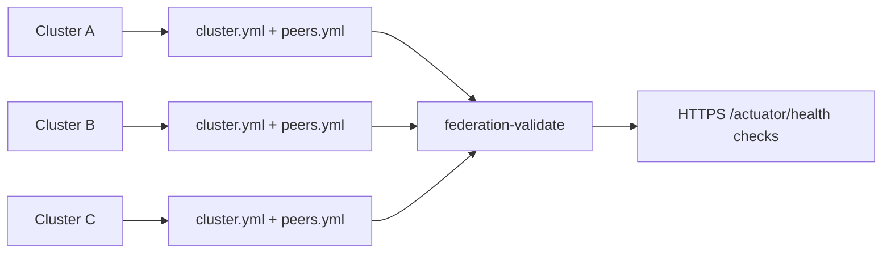

# Production-аудит и эксплуатация

Этот документ фиксирует текущие production-риски Docker Compose deployment и безопасный путь hardening для self-hosted установки Messenger.

Основной `docker-compose.yml` остаётся удобным для разработки. Production-примеры добавлены как opt-in templates и не активны, пока администратор не скопирует и не отредактирует их вручную.

Сравнение production paths и Mermaid-графы находятся в [DEPLOYMENT_MATRIX.md](DEPLOYMENT_MATRIX.md). Podman описан в [PODMAN.md](PODMAN.md), Kubernetes Helm - в [KUBERNETES.md](KUBERNETES.md).

## Список проблем

Перед публичным production нужно закрыть следующие вопросы:

- HTTPS/TLS не настроен внутри application stack; TLS должен завершаться на reverse proxy или ingress.
- Нет готового reverse proxy template для WebSocket upgrade headers, upload body limits и скрытия публичных Swagger/metrics endpoints.
- Backup создаётся через `scripts/messengerctl.sh`, но retention, scheduling и off-host copy policy не включены автоматически.
- Нет systemd unit template для автозапуска после reboot.
- В default Compose не настроена Docker log rotation, поэтому json logs могут заполнить диск.
- Spring Actuator публикует Prometheus-compatible metrics, но не было scrape-template и списка alerts.
- LocalStack включён в default Compose stack и не должен использоваться как production object storage.
- PostgreSQL и Redis ports опубликованы на host в default dev Compose.
- Migration и rollback strategy были описаны только на верхнем уровне; update procedure требует явного backup, migration, health check и restore path.
- Docker Compose hardening минимален: нет production-only read-only filesystem, `no-new-privileges`, resource limits и host-port minimization в default file.
- Нет отдельного production Compose template/profile без dev dependencies и dev ports.

## Добавленные безопасные изменения

В репозиторий добавлены неактивные templates:

- `docker-compose.production.yml.example` - standalone production-like Compose template.
- `podman-compose.production.yml.example` - standalone production-like Podman Compose template.
- `.env.production.example` - production-oriented environment template.
- `helm/values-production.example.yaml` - production values для Helm.
- `helm/values-federation.example.yaml` - federation topology override для Helm.
- `deploy/federation/*.example.yml` - federation inventory examples.
- `deploy/nginx/messenger.conf.example` - пример Nginx HTTPS reverse proxy.
- `deploy/caddy/Caddyfile.example` - пример Caddy HTTPS reverse proxy.
- `deploy/systemd/messenger.service.example` - systemd unit для Compose startup.
- `deploy/systemd/messenger-backup.service.example` и `deploy/systemd/messenger-backup.timer.example` - пример daily backup timer.
- `deploy/prometheus/prometheus.yml.example` - пример Prometheus scrape config.

Перед использованием копируйте templates. Не редактируйте `.example` files на сервере как рабочую конфигурацию.

## HTTPS/TLS

Используйте reverse proxy на host для TLS termination. Рекомендуемые варианты:

- Caddy для автоматических certificates.
- Nginx с Let's Encrypt certificates через Certbot.
- Managed load balancer или ingress controller, если deployment не single-host Compose.

Application containers должны оставаться на localhost или internal Docker network. Публичный traffic должен входить только через ports `80` и `443`.

Production origins:

```dotenv
CORS_ALLOWED_ORIGINS=https://chat.example.com
WS_ALLOWED_ORIGINS=https://chat.example.com
```

## Reverse proxy

Пример Nginx:

```bash
sudo cp deploy/nginx/messenger.conf.example /etc/nginx/conf.d/messenger.conf
sudo nginx -t
sudo systemctl reload nginx
```

Пример Caddy:

```bash
sudo cp deploy/caddy/Caddyfile.example /etc/caddy/Caddyfile
sudo caddy validate --config /etc/caddy/Caddyfile
sudo systemctl reload caddy
```

Templates включают:

- HTTPS redirect;
- `X-Forwarded-*` headers;
- WebSocket upgrade proxying;
- `client_max_body_size 100m` для Nginx;
- блокировку публичного доступа к Swagger и non-health Actuator endpoints.

Если публичные API docs действительно нужны, защищайте их через VPN, SSO, basic auth или IP allow-lists.

## Backup retention

Создать backup:

```bash
./scripts/messengerctl.sh backup --backup-dir /srv/messenger/backups
```

Рекомендуемый базовый retention:

- hourly backups за последние 24 часа, если instance активно используется;
- daily backups за 14 дней;
- weekly backups за 8 недель;
- monthly backups за 12 месяцев, если это требуется политикой;
- минимум одна off-host copy.

Скрипт создаёт архивы, но не удаляет старые backups. Добавьте host-level retention job после проверки политики:

```bash
find /srv/messenger/backups -name 'messenger-backup-*.tar.gz' -type f -mtime +30 -print
```

Добавляйте `-delete` только после проверки вывода:

```bash
find /srv/messenger/backups -name 'messenger-backup-*.tar.gz' -type f -mtime +30 -delete
```

Регулярно проверяйте архивы:

```bash
tar -tzf /srv/messenger/backups/messenger-backup-YYYYmmdd-HHMMSS.tar.gz >/dev/null
```

## systemd autostart

Установка service template:

```bash
sudo cp deploy/systemd/messenger.service.example /etc/systemd/system/messenger.service
sudo systemctl daemon-reload
sudo systemctl enable messenger.service
sudo systemctl start messenger.service
```

Если репозиторий установлен не в `/srv/messenger`, измените `WorkingDirectory=/srv/messenger`.

Установка daily backup timer:

```bash
sudo cp deploy/systemd/messenger-backup.service.example /etc/systemd/system/messenger-backup.service
sudo cp deploy/systemd/messenger-backup.timer.example /etc/systemd/system/messenger-backup.timer
sudo systemctl daemon-reload
sudo systemctl enable --now messenger-backup.timer
```

Проверка:

```bash
systemctl status messenger.service
systemctl list-timers messenger-backup.timer
```

## Log rotation

Production Compose template настраивает Docker `json-file` log rotation:

```yaml
logging:
  driver: json-file
  options:
    max-size: "50m"
    max-file: "5"
```

Для default development Compose stack можно настроить log rotation глобально в Docker daemon:

```json
{
  "log-driver": "json-file",
  "log-opts": {
    "max-size": "50m",
    "max-file": "5"
  }
}
```

Обычно это файл `/etc/docker/daemon.json`. Restart Docker влияет на запущенные containers, поэтому планируйте maintenance window.

## Prometheus и Grafana

Messenger отдаёт Prometheus metrics через Spring Actuator:

```text
http://127.0.0.1:8080/actuator/prometheus
```

Пример Prometheus config:

```bash
cp deploy/prometheus/prometheus.yml.example /etc/prometheus/prometheus.yml
```

Рекомендуемые alerts:

- backend health down;
- PostgreSQL unavailable;
- Redis unavailable;
- рост HTTP 5xx rate;
- JVM heap usage долго остаётся высоким;
- disk usage для Docker volumes или uploads mount выше 80%;
- backup timer failed или последний backup старше policy.

Grafana должна читать metrics из Prometheus. Начните с dashboards для JVM, HTTP latency/error rate, container CPU/memory, PostgreSQL, Redis и host disk usage.

## S3/MinIO вместо LocalStack

LocalStack предназначен для разработки. В production используйте настоящий S3-compatible service:

- AWS S3, Ceph, MinIO, Wasabi или другое durable object storage;
- `STORAGE_PROVIDER=s3`;
- `S3_AUTO_CREATE_BUCKET=false`;
- bucket создан до deployment;
- access key имеет минимально необходимые object permissions;
- object lifecycle и retention настроены вне Messenger.

Пример:

```dotenv
STORAGE_PROVIDER=s3
S3_ENDPOINT=https://minio.example.com
S3_ACCESS_KEY=<access-key>
S3_SECRET_KEY=<secret-key>
S3_BUCKET_NAME=messenger-files
S3_REGION=us-east-1
S3_PATH_STYLE_ACCESS_ENABLED=true
S3_AUTO_CREATE_BUCKET=false
```

Backups должны покрывать PostgreSQL metadata и object storage contents либо bucket versioning/replication policy.

## Migration strategy

Перед каждым update:

```bash
./scripts/messengerctl.sh backup
./scripts/messengerctl.sh doctor
git rev-parse HEAD
```

Рекомендуемый migration flow:

1. Создать и проверить backup archive через `tar -tzf`.
2. Зафиксировать текущий Git commit и image tags.
3. Подтянуть код или развернуть выбранный release.
4. Выполнить `docker compose config` для выбранного Compose file.
5. Запустить `./scripts/messengerctl.sh update` или контролируемый `docker compose up -d --build`.
6. Дождаться Flyway migrations во время backend startup.
7. Проверить `/actuator/health`, web login, WebSocket flow, upload/download файлов, PostgreSQL и Redis.

Для рискованных database migrations сначала проверьте restore и migration на staging copy.

## Rollback strategy

Rollback зависит от того, являются ли migrations backward-compatible.

Базовый безопасный вариант:

```bash
./scripts/messengerctl.sh restore --file backups/messenger-backup-YYYYmmdd-HHMMSS.tar.gz
```

Если менялся только application code, а database migrations backward-compatible:

```bash
git checkout <previous-commit-or-tag>
docker compose up -d --build
```

Если migrations изменили schema destructive-образом, используйте pre-update backup. Не считайте, что `git checkout` сам восстановит database state.

Для каждого release фиксируйте:

- previous commit/tag;
- путь к backup archive;
- обратимы ли migrations;
- ручные data repair steps, если они нужны.

## Hardening Docker Compose

Используйте `docker-compose.production.yml.example` как starting point:

```bash
cp docker-compose.production.yml.example docker-compose.production.yml
cp .env.production.example .env
docker compose -f docker-compose.production.yml config
docker compose -f docker-compose.production.yml up -d --build
```

Template:

- не публикует PostgreSQL и Redis host ports;
- не включает LocalStack и MailHog;
- bind backend и web-client только на `127.0.0.1`;
- добавляет Docker log rotation;
- добавляет `no-new-privileges` для application containers;
- использует read-only root filesystem для backend и worker с `/tmp` как tmpfs;
- требует S3 и secret environment variables вместо silent dev defaults.

Перед усилением hardening проверьте upload/download файлов, migrations и web-client startup. Некоторые frameworks требуют writable temp directories.

## Закрытие dev-портов PostgreSQL/Redis наружу

Default `docker-compose.yml` публикует:

- PostgreSQL: `5432:5432`;
- Redis: `6379:6379`;
- LocalStack: `4566:4566`;
- MailHog SMTP/UI: `1025:1025`, `8025:8025`;
- Backend: `8080:8080`;
- Web client: `3001:3000`.

Для production используйте `docker-compose.production.yml` из template. Он не публикует database/cache ports и bind application ports на localhost для reverse proxy.

Если нужно оставить default Compose file, ограничьте доступ firewall-правилами. Firewall - это запасной вариант; убрать host port publications чище.

## Отдельный production compose profile

Проект намеренно сохраняет `docker-compose.yml` как default/dev stack. Production path - отдельный файл:

```bash
docker compose -f docker-compose.production.yml up -d --build
```

Такой подход избегает хрупкого override-поведения при удалении published ports. Также LocalStack/MailHog полностью отсутствуют в production file.

Если включён disk storage, добавьте `docker-compose.disk.yml`:

```bash
docker compose -f docker-compose.production.yml -f docker-compose.disk.yml up -d
```

## Federation topology

Federation в текущем этапе - это подготовка topology/trust inventory и health validation между несколькими кластерами. Это не backend federation protocol и не межкластерная доставка сообщений.



Команды:

```bash
./scripts/messengerctl.sh federation-init --cluster-id cluster-a --cluster-url https://chat-a.example.com
./scripts/messengerctl.sh federation-add-peer --cluster-id cluster-b --cluster-url https://chat-b.example.com
./scripts/messengerctl.sh federation-validate
```

## Production checklist

- Сильный `JWT_SECRET`, созданный через `openssl rand -base64 64`.
- Default passwords заменены.
- HTTPS reverse proxy настроен.
- `CORS_ALLOWED_ORIGINS` и `WS_ALLOWED_ORIGINS` указывают на public HTTPS origins.
- PostgreSQL и Redis не открыты публично.
- LocalStack и MailHog не используются в production.
- S3/MinIO bucket существует и покрыт backup или versioning.
- Backup schedule и retention настроены.
- Restore проверен на отдельном host.
- systemd unit включён для startup.
- Docker log rotation настроена.
- Prometheus scrape настроен, Grafana dashboards/alerts созданы.
- Update и rollback procedure проверены до критичных releases.
